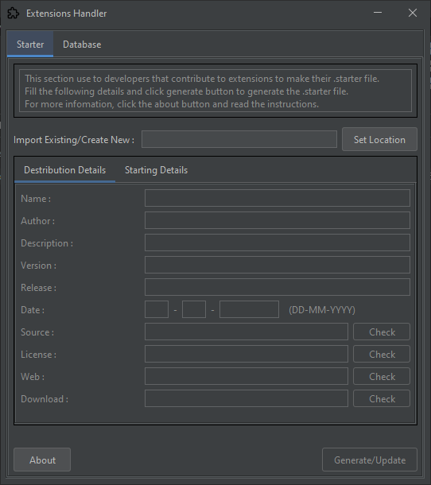

## Starter File

In this section, we discuss the `.starter` file.

- [Starter File](#starter-file)
  - [Why do we need `.starter`?](#why-do-we-need-starter)
  - [Structure](#structure)
  - [Example for `.starter`](#example-for-starter)
  - [How do I update the `.starter`? Any easy method?](#how-do-i-update-the-starter-any-easy-method)
  - [How to create the `.starter`](#how-to-create-the-starter)
  - [How to update the `.starter`](#how-to-update-the-starter)
  - [What's the `Database` section for?](#whats-the-database-section-for)
  - [Still not sure how to do that](#still-not-sure-how-to-do-that)

### Why do we need `.starter`?

`.starter` is the **core** of your extension. Because the application details will store in there. Hotspot Maker will read the `.starter` and get the application details such as `runtime`. We will discuss it later.

### Structure

`.starter` is a `JSON` type file. The only difference is the file extension. In the `.starter` we have these like structure.

```
{
   "Name":"",
   "Author":"",
   "Description":"",
   "Version":"",
   "Release":"",
   "Date":"",
   "Source":"",
   "License":"",
   "Web":"",
   "Download":"",
   "ExeName":"",
   "Runtime":"",
   "RuntimeCall":"",
   "RuntimeAvailability":"",
   "AvailabilityOutcome":"",
   "RuntimeDownload":"",
   "Starter":""
}
```

1. Name : Extension name
2. Author : Extension author
3. Description : A **short description** of what the extension for
4. Version : Extension version
5. Release : Release type (`stable` or `beta` or something)
6. Date : Released date for download
7. Source : Source code location (like `GitHub`, `Google Drive`, etc.)
8. License : License file location (`GitHub` stores the license files or you can set it to the license offered website)
9. Web : Author website or source code location
10. ExeName : The **full name** of the extension with the **file extension**
11. Runtime : Required application `runtime` (like `Java Runtime`, `Python`, etc.)
12. RuntimeCall : The `runtime` trigger (like in `Java`, `java -jar`)
13. RuntimeAvailability : Check the required `runtime` is available (like in `Java`, `java -version`)
14. AvailabilityOutcome : The output you expect from running the `RuntimeAvailability` (like in `Java`, expect `Java(TM) SE Runtime Environment (build 17`. (we will discuss this later))
15. RuntimeDownload : Download link for the target `runtime`
16. Starter : Direct link for `.starter`

### Example for `.starter`

Let's take a look at real-world examples. For that, we take [Hotspot Maker - Toolkit](https://github.com/NaveenB2004/HotspotMaker-Toolkit).

You can find the `.starter` of the project from [here!](https://github.com/NaveenB2004/HotspotMaker-Toolkit/blob/main/.starter)

```
{
   "Name":"Hotspot Maker - Toolkit",
   "Author":"NaveenB2004",
   "Description":"Advanced tools for Hotspot Maker (Extension)!",
   "Version":"0.1",
   "Release":"Stable",
   "Date":"10-08-2023",
   "Source":"https://github.com/NaveenB2004/HotspotMaker-Toolkit",
   "License":"https://github.com/NaveenB2004/HotspotMakaaer-Toolkit/blob/main/LICENSE",
   "Web":"https://github.com/NaveenB2004/HotspotMaker-Toolkit",
   "Download":"https://github.com/NaveenB2004/HotspotMaker-Toolkit/releases/download/v0.1/HotspotMaker-Toolkit-0.1.zip",
   "ExeName":"HotspotMaker-Toolkit-0.1.jar",
   "Runtime":"Java (v17)",
   "RuntimeCall":"java -jar",
   "RuntimeAvailability":"java -version",
   "AvailabilityOutcome":"Java(TM) SE Runtime Environment (build 17",
   "RuntimeDownload":"https://www.oracle.com/java/technologies/javase/jdk17-archive-downloads.html",
   "Starter":"https://raw.githubusercontent.com/NaveenB2004/HotspotMaker-Toolkit/main/.starter"
}
```

The main points that we want to show are,
1. ExeName :\
   In this example, the `ExeName` is `HotspotMaker-Toolkit-0.1.jar`. you need to set it in the right order (`full name.extension). If your launcher is in another folder, you need to set the full path as `ExeName` (imagine that your application is in `folder x/myApp.xyz`, that's your `ExeName`).
2. Runtime :\
   This is the runtime your application is depending on. In this example, the application depends on the `Java Runtime (v17)`. So, just add the `Runtime` as is. If your application doesn't need `runtime` to run on `Windows`, just leave it `empty`.
3. RuntimeCall :\
   In this case, we need to run the application with a *command-line argument*. It's a `Java` program, so we need to run it with `java -jar HotspotMaker-Toolkit-0.1.jar`. So, the RuntimeCall will be `java -jar`. If your application doesn't need `runtime arguments` to run on `Windows`, just leave it `empty`.
4. RuntimeAvailability :\
   After the user triggers the open command, the `Hotspot Maker` will check the required `runtime` is available on their pc. In this case, we need `Java Runtime` installed on the user's pc. How do I know he/she has it? The **recommended way** is to check the `runtime version`. So, for our application, we check the `Java Runtime Version` with the `java -version` *command-line* argument. This will bind with `step 5`.
5. AvailabilityOutcome :\
   After we check the `RuntimeAvailability`, we compare the output with `AvailabilityOutcome`. In this case, the output of the `RuntimeAvailability` will be like this.

   ```
    java version "17.0.8" 2023-07-18 LTS
    Java(TM) SE Runtime Environment (build 17.0.8+9-LTS-211)
    Java HotSpot(TM) 64-Bit Server VM (build 17.0.8+9-LTS-211, mixed mode, sharing)
   ```

   So, we expect to `Java Runtime Version` should be `v17.x`. So, we set the `AvailabilityOutcome` to `Java(TM) SE Runtime Environment (build 17`. Why only a part? We expect *any version* of *parent version* `17` of `Java Runtime`. The `Hotspot Maker` will read the output and get the code phrase that is mentioned. Or you can just set it to `Runtime Environment (build 17`. But note that, you shouldn't mention it like `SE Environment 17`. It will give errors.
6. RuntimeDownload :\
   This is the `runtime` download website. In our case, it's the `Java 17` download page.
7. Starter :\
   It's the direct link to your `.starter` file. As we mentioned before section, you need to put your `.starter` in your cloud. So, what if you need to change the location of the `.starter`? If you change it, our `workflow` will fail to update the `database`. So, if you have that situation, the best thing is, first change the old `.starter`'s `Starter` to point to the new `.starter`. Then after 1 day, our `database` will get your new `.starter`, then on the 2nd day, the `database` will update with your new `.starter`.

### How do I update the `.starter`? Any easy method?

Yes, you have. We mentioned in before the section that you need to download the [Extensions.jar](https://github.com/NaveenB2004/HotspotMaker/raw/main/Extensions/Application/Binary/Extensions.jar) as a basic need. Download it and open it with a double click or using `CMD`, `java -jar Extensions.jar`. To use it, you need [Java Runtime (v17.x)](https://www.oracle.com/java/technologies/javase/jdk17-archive-downloads.html). After the opening process, you can see an interface like this.



### How to create the `.starter`

You can use the `Extensions.jar` to create it or just make a file without a name and the file extension with `.starter`.

- Create with the `Extensions.jar`\
  Click on the button `Set Location` and select a folder to make create the `.starter`. After you click the `Generate/Update` button, the `.starter` will save in the selected directory.

### How to update the `.starter`

Click on the `Set Location` button. Select the `.starter` file (or you can manually enter the path into the `text field` and click the button `Set Location`). After you update the details, click on the `Generate/Update` button.

> Make sure that you have filled in the all details in both the `Distribution Details` & `Starting Details` sections.

### What's the `Database` section for?

It's for our use. We create and update the extensions `database` manually by using that section. There is another *command-line* section for updating the `database` automatically with the `GitHub workflow`.

### Still not sure how to do that

Feel free to create an issue from [here!](https://github.com/NaveenB2004/HotspotMaker/issues)\
Let's discuss this from [here!](https://github.com/NaveenB2004/HotspotMaker/discussions)\
Contact me by [email](mailto:naveennbalasooriya2004@gmail.com "naveennbalasooriya2004@gmail.com") or [telegram](https://t.me/NaveenB2004 "@NaveenB2004")

***

[< Previous-Page][back] | [Next-Page >][next]

[back]: 02.%20How%20Do%20I%20Contribute.md "How Do I Contribute?"
[next]: 04.%20Troubleshoot.md "Troubleshoot"