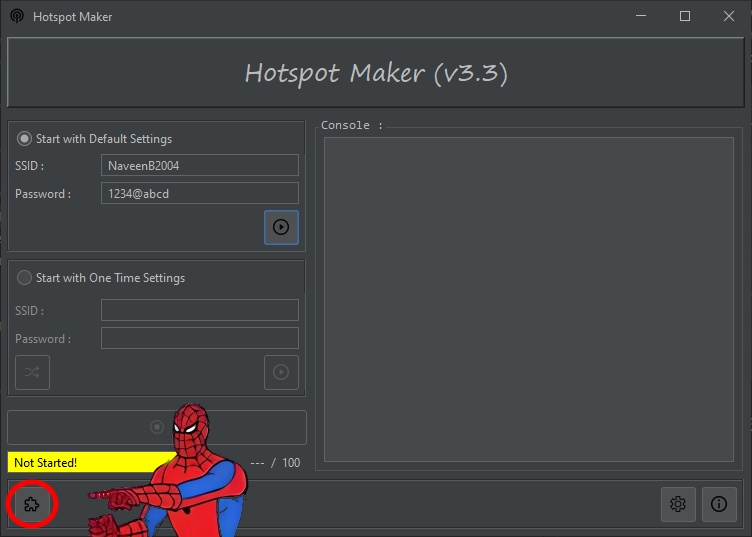

## Extensions & Basic Interface

Hotspot Maker  - Extensions are made to bring users more advanced tools to improve your hosted network's use.

### Access to the Extensions

The only method that you have to access the extensions is the button `Extensions` in the `Main Interface` of `Hotspot Maker`. (The interface may be changed in new releases)

### Get to Know the Extensions Interface

1. Extensions Table\
   In this table, you can see the basic details of extensions that you can install. `ID` is the extension id that extension registerd. `Name` is the extension name. `Author` is the author of the extension. In the first run of the extensions, the application will download the database and fetch data to the table. (Problem while downloading? See [Troubleshooting])
2. Extesion Details\
   In this section, you can see the more of details about extension you selected from the `Extensions Table`. you can see the `ID`, `Name`, `Author` also in here. `Description` is the extension description that gave by the `Author` about the basic use of the extension. `Version` is the extension version that logged in `database`. `Release` is the type of the extension release like `beta`, `stable`, etc. `Date` is the date that the extension released for download.
3. Extesions Database Details
   In this section, you can see the basic details about the extensions `database`. `Extensions Found` is the count of the extensions that the current `database` has. `Database Version` is the current version of the extensions `database`. (Button actions will discuss in next points). (Problem with database details? See [Troubleshooting])
4. Extesions Database Update
   In this button, you can check for updates on your extensions `databse`. If there is a update, it will automatically download it. (Problem with database update? See [Troubleshooting])

[Troubelshooting]: 05.%20Troubleshooting.md