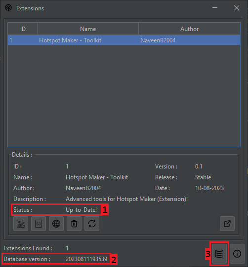

## Update Extensions Database

This section will help you to get updates of the extensions. Besically we discuss about,
- [Update Extensions Database](#update-extensions-database)
  - [What is the need of Updating Database?](#what-is-the-need-of-updating-database)

### What is the need of Updating Database?

Good question. In our application, we maintain a cloud database (online database) & local database (on your pc). 

We use the local database to fetch the details to the `Extensions Table` & `Detals Section`. This will help the application to perform extension task like run extensions, uninstall extensions, get details about the extensions if you are offline. But then, you can't check updates, install or update extensions.

We are updating the cloud database onece per day. But you will not getting any updates on extensions daily. If a developer release a new version of extension, you will be able to get the new version of database.