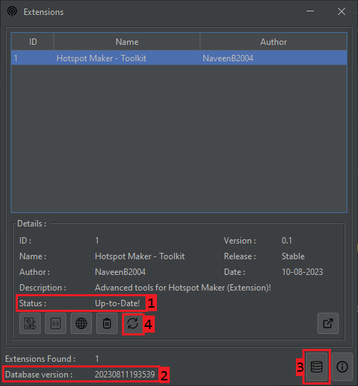

## Update Extensions Database

This section will help you to get updates of the extensions. Besically we discuss about,
- [Update Extensions Database](#update-extensions-database)
  - [What is the need of Updating Database?](#what-is-the-need-of-updating-database)
  - [How do I update the Database?](#how-do-i-update-the-database)

### What is the need of Updating Database?

Good question. In our application, we maintain a cloud database (online database) & local database (on your pc). 

We use the local database to fetch the details to the `Extensions Table` & `Details Section`. This will help the application perform extension tasks like running extensions, uninstalling extensions, and getting details about the extensions if you are offline. But, you can't check updates, install or update extensions in offline mode.

We are updating the cloud database once per day (UTC 12AM). But you will not get any updates on extensions daily. If a developer releases a new version of the extension, you will be able to get the new version of the database.

The updated databases have the latest versions of extensions and details. It will help to update and download the extensions. So, that's the reason for database updates.

### How do I update the Database?

It's easy. Just click on `Check Database Updates` button (reffer the image - 3). It will trigger a update check and download fresh database. After done, you will recieve a message about database version. If the message body contains `Done!` there's no extension updates. Else the message body contains `Hooray! New Database!` there's also extenson updates. You can see the database current version in `Database Version` detail (reffer the image - 2).

After updating the database, each extension update status will indicate in `Details Section`, `Status` detail (reffer the image - 1). You can update each extension by clicking the `Re-install/Update` button (reffer the image - 4).

***

[< Previous-Page][back] | [Next-Page >][next]

[back]: 01.%20Extensions%20&%20Basic%20Interface.md "Extensions & Basic Interface"
[next]: 03.%20Troubleshooting.md "Troubleshooting"