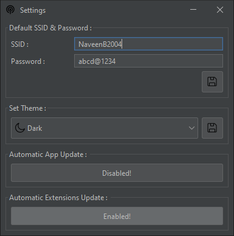

# Hotspot Maker


Hotspot Maker is a software you can use to basically start & stop hotspots in a Windows environment. There we release `Java-based` GUI applications to make a better experience for users. Our good old CLI application is also [here](https://github.com/NaveenB2004/HotspotMaker/releases/tag/v2.7) for experiments. Try this out! And make sure to send feedback!


- [Hotspot Maker](#hotspot-maker)
    - [Features](#features)
    - [The Basic Interfaces](#the-basic-interfaces)
    - [How to use it?](#how-to-use-it)
    - [Build from source](#build-from-source)
    - [For developers](#for-developers)
    - [License](#license)


### Features

- Start hotspot
- Stop hotspot
- Save a default profile (name & password)
- Start hotspot with one-time profile (name & password)
- Different themes (default, light & dark)
- Automatic update check
- Hotspot status indicator
- Connected client count indicator
- Extensions for advanced tasks

### The Basic Interfaces

It's very easy to use `Hotspot Maker`. Let's take a look at each interface.

- Main Interface\
  \
  In here, you can perform the basic tasks of `Hotspot Maker`. It's easy to understand & well organized. You can start the hotspot using the default & one-time username & password. To set the default profile, go to settings & set it.

- Settings Interface\
  \
  Here, you can save a default profile and set themes.

- About Interface\
  \
  Here, you can get the details about the developer and the application.

- Extensions Interface\
  \
  In here, you can download & use the advanced extension built for Hotspot Maker.

### How to use it?

In the main interface,
- To start a hotspot, you can use the default (if you do not set a default profile, you can do it in settings) or a one-time profile. Select the profile you want & click on the `start` button.
- To stop the hotspot, just click on the `stop` button.
- You can see the hotspot start & stop details in the console as well.
- The status indicator will show the current status of the hotspot.
- The connected clients count indicator will show the maximum number of clients who can connect & the present connected clients count.

In the settings interface,
- To save a default profile, fill in the SSID (name) & Password fields & click on the save button.
- To change the theme, select a theme from the dropdown menu & click on the save button.

For the extensions, we have documentation for you! [Read it from here!](Extensions/README.md)

### Build from source

The basic needs,
- `Java` ([JDK](https://www.oracle.com/java/technologies/javase/jdk17-archive-downloads.html)) version `17.x`
- Maven (for build purpose)(latest is recommended)(if you install  NetBeans IDE this will be installed with it)
- [NetBeans IDE](https://netbeans.apache.org/download/index.html) (latest is recommended)(this is for load UI if you edit the source)

Build with NetBeans IDE
- Clone the repository
- Open `HotpotMaker` (HotspotMaker\HotspotMaker) as a project.
- Select `clean and build`

Build with command-line
- Clone the repository
- Open Command Prompt (`CMD`) or `PowerShell`
- Run the command,
  ```
  mvn package --file "projectDir\HotspotMaker\pom.xml"
  ```

### For developers

We are happy to announce our `Extensions` feature! We are grateful to invite you to contribute to it! Please read the documentation about the `Extensions` & make a move!

### License

[The Unlicense](LICENSE)

This is free and unencumbered software released into the public domain.

Anyone is free to copy, modify, publish, use, compile, sell, or
distribute this software, either in source code form or as a compiled
binary, for any purpose, commercial or non-commercial, and by any
means.

In jurisdictions that recognize copyright laws, the author or authors
of this software dedicate any and all copyright interest in the
software to the public domain. We make this dedication for the benefit
of the public at large and to the detriment of our heirs and
successors. We intend this dedication to be an overt act of
relinquishment in perpetuity of all present and future rights to this
software under copyright law.

THE SOFTWARE IS PROVIDED "AS IS", WITHOUT WARRANTY OF ANY KIND,
EXPRESS OR IMPLIED, INCLUDING BUT NOT LIMITED TO THE WARRANTIES OF
MERCHANTABILITY, FITNESS FOR A PARTICULAR PURPOSE AND NONINFRINGEMENT.
IN NO EVENT SHALL THE AUTHORS BE LIABLE FOR ANY CLAIM, DAMAGES OR
OTHER LIABILITY, WHETHER IN AN ACTION OF CONTRACT, TORT OR OTHERWISE,
ARISING FROM, OUT OF OR IN CONNECTION WITH THE SOFTWARE OR THE USE OR
OTHER DEALINGS IN THE SOFTWARE.

For more information, please refer to <https://unlicense.org>
